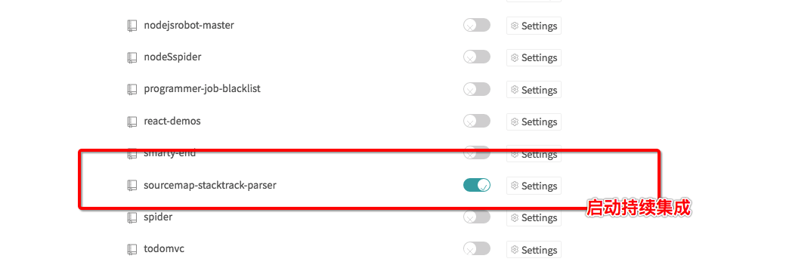
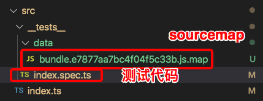
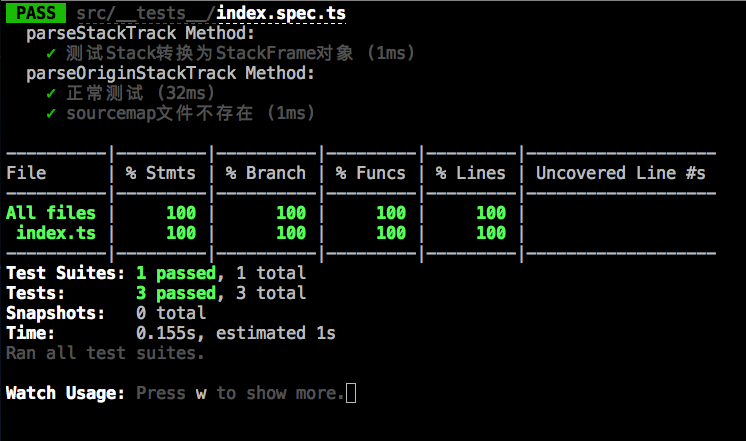
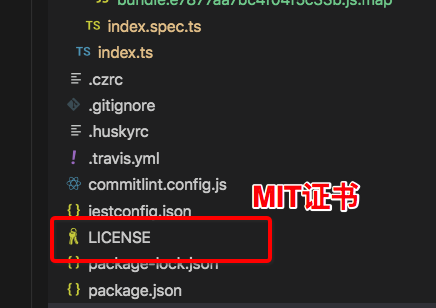
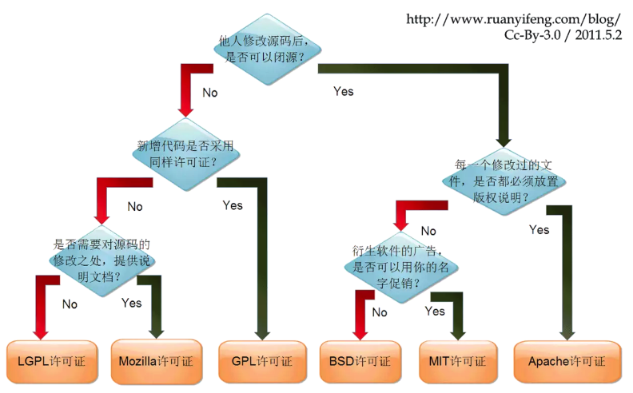

# 从0到1开发一个开源项目(TS + ESlint + Jest + TravisCI)

最近想尝试一下如何开源一个项目，正好手边做异常监控的时候遇到一个功能。就是解析errorstack中的源码位置。在npm中找了好久都没有合适的库。正好自己造一个轮子发布出来。也趁这个机会把开源过程整理一下。

## 搭建项目框架

### 创建文件夹

```bash
# 创建项目文件件
mkdir sourcemap-stacktrack-parser
# 创建README.md文件
echo "# sourcemap-stacktrack-parser" >> README.md
```

### 初始化git仓库

```bash
git init
# 添加README文件
git add README.md
# 提交代码
git commit -m "first commit"
# 设置远程仓库地址
git remote add origin git@github.com:su37josephxia/sourcemap-stacktrack-parser.git
# 推送代码
git push -u origin master

```

### 初始化npm

```bash
npm init -y
```

### 初始化tsc

#### 安装typescript包

```bash
npm i typescript ts-node-dev @types/node -d
```

#### 创建tsconfig.json文件

```json
{
    "compilerOptions": {
        "outDir": "./lib",
        "target": "es2017",
        "module": "commonjs",//组织代码方式
        "sourceMap": true,
        "moduleResolution": "node", // 模块解决策略
        "experimentalDecorators": true, // 开启装饰器定义
        "allowSyntheticDefaultImports": true, // 允许es6方式import
        "lib": ["es2015"],
        "typeRoots": ["./node_modules/@types"],
    },
    "include": ["src/**/*"]
}
```

#### 创建index.js文件

```js
mkdir src
echo 'console.log("helloworld")' >> src/index.ts
```

#### 添加npm脚本

在package.json文件中添加

```
"scripts": {
    "start": "ts-node-dev ./src/index.ts -P tsconfig.json --no-cache",
    "build": "tsc -P tsconfig.json",
}
```

#### 修改程序入口

修改package.json中

````json
{
  ...
  "main": "lib/index.js",
  ...
}
````

#### 验证

```bash
npm start
```


### 初始化Jest测试

#### 安装jest库

```bash
npm install jest ts-jest @types/jest -d
```

#### 创建jestconfig.json文件

```json
{
  "transform": {
    "^.+\\.(t|j)sx?$": "ts-jest"
  },
  "testRegex": "(/__tests__/.*|(\\.|/)(test|spec))\\.(jsx?|tsx?)$",
  "moduleFileExtensions": ["ts", "tsx", "js", "jsx", "json", "node"]
}
```

####  package.json里的 scripts 下的 test 

```json
{
  "scripts": {
    "test": "jest --config jestconfig.json --coverage",
  }
}
```

#### 源码中导出一个函数

```js
export const add = (a: number, b: number) => a + b
```

#### 创建测试用例

在src/\___tests\___文件夹中创建index.spec.ts

```js
import { add } from "../index";
test("Index add fun", () => {
    const ret = add(1, 2)
    console.log(ret)
    expect(ret).toBe(3);
});
```

#### 启动测试用例

```bash
npm run test
```

### 初始化Eslint

安装eslint包

```
npm install prettier tslint tslint-config-prettier -d
```
配置tslint.json
```json
{
  "extends": ["tslint:recommended", "tslint-config-prettier"],
  "rules": {
    "no-console": false, // 忽略console.log
    "object-literal-sort-keys": false,
    "member-access": false,
    "ordered-imports": false
  },
  "linterOptions": {
    "exclude": ["**/*.json", "node_modules"]
  }
}
```

#### 配置 .prettierrc

Prettier 是格式化代码工具。用来保持团队的项目风格统一。

```json
{
  "trailingComma": "all",
  "tabWidth": 4,
  "semi": false,
  "singleQuote": true,
  "endOfLine": "lf",
  "printWidth": 120,
  "overrides": [
    {
      "files": ["*.md", "*.json", "*.yml", "*.yaml"],
      "options": {
        "tabWidth": 2
      }
    }
  ]
}
```

####  配置.editorconfig

“EditorConfig帮助开发人员在不同的编辑器和IDE之间定义和维护一致的编码样式。EditorConfig项目由用于定义编码样式**的文件格式**和一组**文本编辑器插件组成**，这些**插件**使编辑器能够读取文件格式并遵循定义的样式。EditorConfig文件易于阅读，并且与版本控制系统配合使用。

对于VS Core，对应的插件名是[EditorConfig for VS Code](https://marketplace.visualstudio.com/items?itemName=EditorConfig.EditorConfig)

````bash
# EditorConfig is awesome: https://EditorConfig.org

# top-most EditorConfig file
root = true

# Unix-style newlines with a newline ending every file
[*]
end_of_line = lf
insert_final_newline = true
charset = utf-8
indent_style = space
indent_size = 4

[{*.json,*.md,*.yml,*.*rc}]
indent_style = space
indent_size = 2
````

添加script脚本

```json
{
  "scripts": {
    "format": "prettier --write \"src/**/*.ts\" \"src/**/*.js\"",
    "lint": "tslint -p tsconfig.json"
  }
}
```


### 设置 git 提交的校验钩子

#### 安装husky库

```js
npm install husky -d
```

#### 新建.huskyrc

```js
{
    "hooks": {
        "pre-commit": "npm run format && npm run lint && npm test"
    }
}
```

#### 验证结果


### 设置Travis CI

Travis CI 提供的是持续集成服务，它仅支持 Github，不支持其他代码托管。它需要绑定 Github 上面的项目，还需要该项目含有构建或者测试脚本。只要有新的代码，就会自动抓取。然后，提供一个虚拟机环境，执行测试，完成构建，还能部署到服务器。只要代码有变更，就自动运行构建和测试，反馈运行结果。确保符合预期以后，再将新代码集成到主干。


这个项目需要Travis在提交后自动进行测试并且向codecov提供测试报告。

- 测试
- 报告分析


#### 登录TravicCI网站

登录https://www.travis-ci.org/网站

使用github账号登录系统

#### 配置.travis.yml

运行自动化测试框架

```yaml
language: node_js               # 项目语言，node 项目就按照这种写法就OK了
node_js:
- 13.2.0 			# 项目环境
cache:				# 缓存 node_js 依赖，提升第二次构建的效率
  directories:
  - node_modules
test:
  - npm run test # 运行自动测试框架
```

>  参考教程：[Travis CI Tutorial](https://docs.travis-ci.com/user/tutorial/)

#### 上传配置到github

#### 启动持续集成

通过github账号登录travis




#### 获取持续集成通过徽标

将上面 URL 中的 {GitHub 用户名} 和 {项目名称} 替换为自己项目的即可，最后可以将集成完成后的 markdown 代码贴在自己的项目上


```
http://img.shields.io/travis/{GitHub 用户名}/{项目名称}.svg
```


#### 设置Codecov

Codecov是一个开源的测试结果展示平台，将测试结果可视化。Github上许多开源项目都使用了Codecov来展示单测结果。Codecov跟Travis CI一样都支持Github账号登录，同样会同步Github中的项目。

https://codecov.io/

```js
npm install codecov -d
```

在package.json添加codecov

```json
{
    ...,
    "scripts": {
        ...,
        "codecov": "codecov"
    }
}
```

在travis.yaml中添加

```yaml
after_success:			# 构建成功后的自定义操作
- npm run codecov		# 生成 Github 首页的 codecov 图标
```


将图标嵌入到README.md之中

```
[](https://codecov.io/gh/<Github Username>/<Repository Name>/)
```

最后获取测试通过图标

[](https://codecov.io/gh/su37josephxia/sourcemap-stacktrack-parser)


## TDD方式编写功能

### 编写测试用例

这个库的功能需要将js错误的调用栈中的压缩代码位置转换为源码位置。当然要借助sourcemap的帮忙。所以输入数据分别是errorstack和sourcemap。



首先把测试用的sourcemap放入src/\__test\__目录中

然后编写测试用例index.spec.ts

```js
import StackParser from "../index"
const { resolve } = require('path')
const error = {
  stack: 'ReferenceError: xxx is not defined\n' +
    '    at http://localhost:7001/public/bundle.e7877aa7bc4f04f5c33b.js:1:1392\n' +
    '    at http://localhost:7001/public/bundle.e7877aa7bc4f04f5c33b.js:1:1392',
  message: 'Uncaught ReferenceError: xxx is not defined',
  filename: 'http://localhost:7001/public/bundle.e7877aa7bc4f04f5c33b.js'
}
describe('parseStackTrack Method:', () => {
  it("测试Stack转换为StackFrame对象", () => {
    expect(StackParser.parseStackTrack(error.stack, error.message))
      .toContainEqual(
        {
          columnNumber: 1392,
          lineNumber: 1,
          fileName: 'http://localhost:7001/public/bundle.e7877aa7bc4f04f5c33b.js',
          source: '    at http://localhost:7001/public/bundle.e7877aa7bc4f04f5c33b.js:1:1392'
        })
  })
})

describe('parseOriginStackTrack Method:', () => {
  it("正常测试", async () => {
    const parser = new StackParser(resolve(__dirname, './data'))
    const originStack = await parser.parseOriginStackTrack(error.stack, error.message)
    // 断言 
    expect(originStack[0]).toMatchObject(
      {
        source: 'webpack:///src/index.js',
        line: 24,
        column: 4,
        name: 'xxx'
      }
    )
  })

  it("sourcemap文件不存在", async () => {
    const parser = new StackParser(resolve(__dirname, './xxx'))
    const originStack = await parser.parseOriginStackTrack(error.stack, error.message)
    // 断言 
    expect(originStack[0]).toMatchObject(
      {
        columnNumber: 1392,
        lineNumber: 1,
        fileName: 'http://localhost:7001/public/bundle.e7877aa7bc4f04f5c33b.js',
        source: '    at http://localhost:7001/public/bundle.e7877aa7bc4f04f5c33b.js:1:1392'
      }
    )
  })
})

```


### 实现功能

```js
const ErrorStackParser = require('error-stack-parser')
const { SourceMapConsumer } = require('source-map')
const path = require('path')
const fs = require('fs')
export default class StackParser {
    private sourceMapDir: string
    private consumers: Object
    constructor(sourceMapDir) {
        this.sourceMapDir = sourceMapDir
        this.consumers = {}
    }
    /**
     * 转换错误对象
     * @param stack 堆栈字符串
     * @param message 错误信息
     */
    static parseStackTrack(stack: string, message?: string) {
        const error = new Error(message)
        error.stack = stack
        const stackFrame = ErrorStackParser.parse(error)
        return stackFrame
    }

    /**
     * 转换错误对象
     * @param stack 堆栈字符串
     * @param message 错误信息
     */
    parseOriginStackTrack(stack: string, message?: string) {
        const frame = StackParser.parseStackTrack(stack,message)
        return this.getOriginalErrorStack(frame)
    }


    /**
     * 转换源代码运行栈
     * @param stackFrame 堆栈片段
     */
    async getOriginalErrorStack(stackFrame: Array<Object>) {
        const origin = []
        for (let v of stackFrame) {
            origin.push(await this.getOriginPosition(v))
        }
        return origin
    }

    /**
     * 转换源代码运行栈
     * @param stackFrame 堆栈片段
     */
    async getOriginPosition(stackFrame) {
        let { columnNumber, lineNumber, fileName } = stackFrame
        fileName = path.basename(fileName)
        // 判断consumer是否存在
        let consumer = this.consumers[fileName]
        if (consumer === undefined) {
            // 读取sourcemap
            const sourceMapPath = path.resolve(this.sourceMapDir, fileName + '.map')
            // 判断文件是否存在
            if (!fs.existsSync(sourceMapPath)) {
                return stackFrame
            }
            const content = fs.readFileSync(sourceMapPath, 'utf-8')
            // console.log('content',content)
            consumer = await new SourceMapConsumer(content, null)
            this.consumers[fileName] = consumer
        }
        const parseData = consumer.originalPositionFor({line:lineNumber,column:columnNumber})

        return parseData
    }

}
```


### 启动jest进行调试

```bash
npm run dev
```




## 添加开源许可证

每个开源项目都需要配置一份合适的开源许可证来告知所有浏览过我们的项目的用户他们拥有哪些权限，具体许可证的选取可以参照阮一峰前辈绘制的这张图表：


那我们又该怎样为我们的项目添加许可证了？其实 Github 已经为我们提供了非常简便的可视化操作: 	我们平时在逛 github 网站的时候，发现不少项目都在 [README.md](http://README.md) 中添加徽标，对项目进行标记和说明，这些小图标给项目增色不少，不仅简单美观，而且还包含清晰易懂的信息。

1. 打开我们的开源项目并切换至 **Insights** 面板
2. 点击 Community 标签
3. 如果您的项目没有添加 License，在 **Checklist** 里会提示您添加许可证，点击 **Add** 按钮就进入可视化操作流程了





## 编写文档

### 编写README.md

#### 编写内容

可以参考README最佳实践

参考https://github.com/jehna/readme-best-practices/blob/master/README-default.md

#### 添加修饰图标

之前已经添加了travisci的build图标和codecov的覆盖率图表。

如果想继续丰富图标给自己的项目增光添彩登录

[shields.io/](http://shields.io/) 这个网站

比如以添加github的下载量为例


### 编写package.json描述信息

### JSdoc

## 添加开源许可证

每个开源项目都需要配置一份合适的开源许可证来告知所有浏览过我们的项目的用户他们拥有哪些权限，具体许可证的选取可以参照阮一峰前辈绘制的这张图表：




那我们又该怎样为我们的项目添加许可证了？其实 Github 已经为我们提供了非常简便的可视化操作: 	我们平时在逛 github 网站的时候，发现不少项目都在 [README.md](http://README.md) 中添加徽标，对项目进行标记和说明，这些小图标给项目增色不少，不仅简单美观，而且还包含清晰易懂的信息。

1. 打开我们的开源项目并切换至 **Insights** 面板
2. 点击 Community 标签
3. 如果您的项目没有添加 License，在 **Checklist** 里会提示您添加许可证，点击 **Add** 按钮就进入可视化操作流程了


## 发布到NPM仓库

### 创建发布脚本

publish.sh

```bash
#!/usr/bin/env bash
npm config get registry # 检查仓库镜像库
npm config set registry=http://registry.npmjs.org
echo '请进行登录相关操作：'
npm login # 登陆
echo "-------publishing-------"
npm publish # 发布
npm config set registry=https://registry.npm.taobao.org # 设置为淘宝镜像
echo "发布完成"
exit
```

执行发布

```bash
./publish.sh
```

填入github用户名密码后


登录https://www.npmjs.com/~josephxia


就可以看到自己的第一个开源作品诞生啦。

## 总结

基本上把开源过程和TDD的开发走了一遍。

因为是第一遍完整的走感觉还是挺麻烦的。后续我也找找有没有相应的脚手架和工具。如果没有特别合适的考虑自己造一个这样的轮子。

